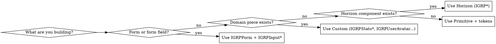

# IGRP Design System

The `@igrp/igrp-framework-react-design-system` package ships a **three-layer UI kit** for IGRP applications: opinionated Horizon components, low-level shadcn-style Primitives, and domain Custom components. Picking the right layer is the single most important decision when writing UI in this repo — getting it wrong produces inconsistent UI and breaks form wiring.

This skill tells you how to pick, how to consume, and which APIs to reach for. For the full component catalog see `references/` (load only what you need).

## Hard rules (non-negotiable)

These come from the repo's UI rules and apply to every IGRP app, template, and consumer:

- **All UI comes from `@igrp/igrp-framework-react-design-system`.** Never reach for raw shadcn, MUI, Mantine, Chakra, Ant, etc.
- **`'use client'` is required** on any file that imports from the design system. The package is wrapped in a `'use client'` boundary.
- **Forms are always `IGRPForm` + Zod.** Never raw `<form>` or direct `react-hook-form`. Form inputs (`IGRPInputText`, `IGRPSelect`, etc.) auto-wire to the surrounding `IGRPForm` via context.
- **Only semantic tokens** for color: `bg-background`, `text-foreground`, `text-muted-foreground`, `border-input`, `bg-primary`, `bg-destructive`, etc. Never raw Tailwind palette colors (`bg-blue-500`, `text-red-600`). If a token is missing, add one — don't bypass.
- **No manual `dark:` overrides** in app code. Tokens handle dark mode. Primitives may use `dark:` only for opacity adjustments on tokens (e.g. `dark:bg-input/30`).
- **Class merging via `cn()`** imported from the DS, not other utilities.
- **`size-*` when width equals height** (`size-10`, not `w-10 h-10`).
- **Spacing via `flex gap-*`** — not `space-x-*` / `space-y-*`.
- **Import tokens only**, never the legacy `/styles` bundle: `@import "@igrp/igrp-framework-react-design-system/tokens";`

## The three layers — picking one

| Layer | Prefix | Use when |
| --- | --- | --- |
| **Horizon** | `IGRP*` | **Default for everything.** Built-in label, helper text, icon, loading, error display, form-context wiring. |
| **Primitives** | unprefixed shadcn-style (`Button`, `Card`, `Input`) | Only when Horizon is too opinionated for what you need — e.g. building a custom composite, or a chrome piece that explicitly should not bind to a form. |
| **Custom** | `IGRP*` (domain-specific) | Premade domain pieces: `IGRPUserAvatar`, `IGRPStatsCardMini`, `IGRPStatsCardTopBorderColored`, `IGRPStatusBanner`. |



**Why this order?** Horizon already bundles the conventions (labels, icons, loading states, form wiring). Skipping to a Primitive means manually re-implementing those — and you'll re-implement them inconsistently across the codebase. Primitives are the escape hatch, not the default.

**Don't mix layers in one component without reason.** A Horizon form with bare `<Input>` Primitives inside it will not wire to the form context and will silently fail validation.

## Imports — single entry point

Everything ships from the package root. There is exactly **one** runtime entry and one CSS entry:

```ts
import { IGRPForm, IGRPInputText, IGRPButton, IGRPDataTable, cn } from "@igrp/igrp-framework-react-design-system"
```

```css
@import "@igrp/igrp-framework-react-design-system/tokens";
```

No deep imports (`@igrp/igrp-framework-react-design-system/dist/...`) — they will break the unbundled build.

## When to load a reference file

Load the smallest set you need. SKILL.md alone is enough to pick a component; load deeper docs only when you're about to write or modify code involving that component family.

- **`references/horizon.md`** — full catalog of Horizon (`IGRP*`) components grouped by family with prop highlights. Load when you need a component you don't already know.
- **`references/primitives.md`** — full list of unprefixed shadcn-style Primitives + when each is the right drop-down from Horizon.
- **`references/forms.md`** — `IGRPForm`, `IGRPFormField`, `IGRPFormList`, all `IGRPInput*`/`IGRPSelect`/`IGRPCheckbox`/`IGRPRadioGroup`/`IGRPSwitch`/`IGRPTextarea`/`IGRPCombobox`/`IGRPDatePicker*`/`IGRPCalendar*` and the Zod + react-hook-form integration. **Load this whenever a form is in scope.**
- **`references/data-table.md`** — `IGRPDataTable`, `createIGRPColumnHelper`, cell renderers, filters, row actions, server-side pagination.
- **`references/charts.md`** — `IGRPAreaChart`, `IGRPBarChart` (horizontal/vertical), `IGRPLineChart`, `IGRPPieChart`, `IGRPRadarChart`, `IGRPRadialBarChart` + `IGRP_CHART_COLORS`, `formatChartValue`, `createChartConfig`.
- **`references/utilities.md`** — `cn`, `IGRPColors`, `igrpGridSizeClasses`, `igrpGetInitials`, `parseLocalDate`, color converters, hooks (`useIsMobile`, `useIGRPMetaColor`).
- **`references/custom.md`** — domain-specific components and when to reach for them.

## Common pitfalls

- **Wiring a Primitive `<Input>` inside `IGRPForm`** — the input won't bind. Use `IGRPInputText` (or another `IGRPInput*`); it reads form context via `useFormContext()` and auto-registers.
- **Raw `<form onSubmit={...}>`** — bypasses validation, error toasts, and the `IGRPFormHandle` imperative API. Use `IGRPForm schema={zodSchema} onSubmit={...}`.
- **`bg-blue-500` / `text-red-600`** — raw palette colors break theming. Use `bg-primary`, `text-destructive`, `IGRPColors.success.solid`, etc.
- **`w-10 h-10`** — use `size-10`.
- **`space-x-2`** — use `flex gap-2`.
- **Forgetting `'use client'`** — produces a Next.js server-component error on first render because the DS is client-only.
- **Importing `@igrp/igrp-framework-react-design-system/styles`** — that bundle was removed. Import `/tokens` only; Tailwind v4 in the app compiles utilities, the DS only ships CSS variables.
- **Manual `dark:` classes in app code** — tokens handle dark mode; if it doesn't look right, fix the token, not the consumer.

## Quick API spot-check

| You want… | Use this |
| --- | --- |
| Text input bound to a form | `IGRPInputText name="..."` inside `IGRPForm` |
| A button | `IGRPButton` (Horizon) — has `loading`, `loadingText`, `iconName`, `iconPlacement` |
| A modal | `IGRPModalDialog` + `IGRPModalDialogContent` (sizes: sm/md/lg/xl/full) |
| A confirm prompt | `IGRPAlertDialog` |
| A table | `IGRPDataTable` with `createIGRPColumnHelper<TRow>()` |
| A chart | `IGRPAreaChart` / `IGRPLineChart` / etc.; colors from `IGRP_CHART_COLORS` |
| A tabs UI | `IGRPTabs` with `IGRPTabItem[]` |
| Page header | `IGRPPageHeader` |
| Stats card | `IGRPStatsCard` (generic) / `IGRPStatsCardMini` (custom) |
| Class merge | `cn(...)` from the DS root |
| Initials from a name | `igrpGetInitials(name)` |
| Grid sizing utility classes | `igrpGridSizeClasses` |
| Token-aware color classes | `IGRPColors.primary.solid`, `.outline`, `.soft` |

For anything not in this table, open `references/horizon.md` first.
